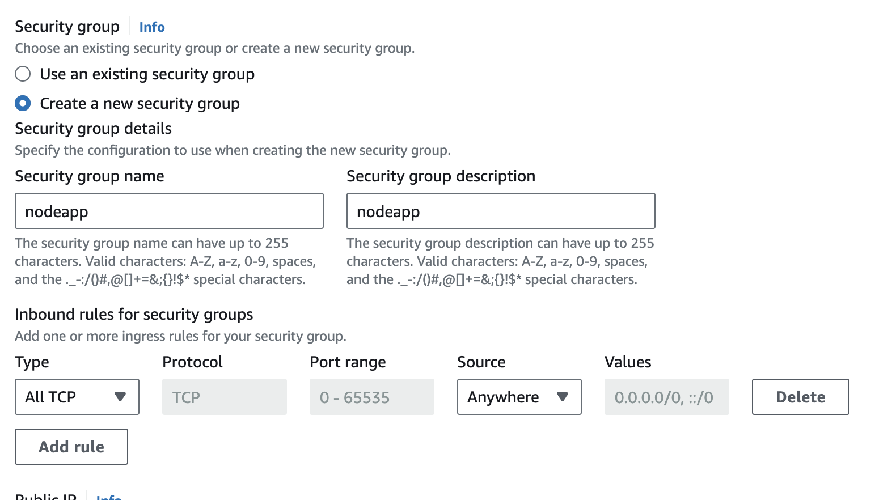

# 3-apps-3-ways-to-deploy

## Sobre essa apresentação

### Combinados

- Não tente reproduzir o que estou fazendo enquanto está assistindo a apresentação

- Pode interromper para perguntas. Não fique com dúvidas!

## Serviços da AWS

 https://k21academy.com/amazon-web-services/overview-of-amazon-web-services-concepts/

### EC2 - Elastic Compute Cloud (C2)

Serviço de Compute

IaaS - Infrastructure as a Service

Criação de máquinas virtuais sob demanda

Além das máquinas, gerenciar Redes Virtuais, Discos e Segurança

Necessidade de configuração manual, a nível de Sistema Operacional e Redes Virtuais

### ECS - Elastic Container Service

Serviço de Container

PaaS - Platform as a Service

Criação de containers Docker sob demanda

Sua preocupação é com a aplicação e a plataforma que a executa, o Docker, não com a infraestrutura

### ECR - Elastic Container Registry

Registry de imagens de containers Docker

CodeBuild pode ser usado para automatizar o build e push de imagens

### AWS Lambda

Serverless

FaaS - Function as a Service

Execução de código sem a necessidade de gerenciar a infraestrutura

### API Gateway

Serviço de gerenciamento de APIs

Criação de APIs RESTful e WebSocket

## Free tier

Ao criar uma conta na AWS, você tem acesso ao free tier, que te dá acesso a utlização de alguns serviços em certas condições gratuitamente por 12 meses

Atenção na hora de criar recursos, pois alguns podem não estar no free tier e você pode ser cobrado por isso

https://aws.amazon.com/free/

## EC2

### Agenda

- Criar uma instância
- Conectar via EC2 Instance Connect
- Instalar dependências
- Clonar o repositório
- Rodar a aplicação
- Configurar o Nginx

### Configurações

Amazon Linux 2023 AMI 2023.3.20240304.0 x86_64 HVM kernel-6.1

t3.micro

Sem keypair (o ideal seria criar uma, então para um projeto mais crítico, crie uma)

Network settings

- Allow SSH traffic from anywhere
- Allow HTTPS traffic from the internet
- Allow HTTP traffic from the internet

Storage
1x 8gb gp3

### Conectar

Recomendo via EC2 Instance Connect, para coisas simples, já que não temos um keypair

### Dependências

```bash
sudo yum install git
python3 -m ensurepip --upgrade
pip3 install gunicorn
sudo yum install nginx
```

Se o repositório for privado, é necessário [configurar chaves SSH](https://docs.github.com/pt/authentication/connecting-to-github-with-ssh/generating-a-new-ssh-key-and-adding-it-to-the-ssh-agent) e [adicionar no Github](https://docs.github.com/pt/authentication/connecting-to-github-with-ssh/adding-a-new-ssh-key-to-your-github-account)

```bash
ssh-keygen -t ed25519 -C "your_email@example.com"
cat ~/.ssh/id_ed25519.pub
```

### Clonar o repositório

```bash
git clone git@github.com:hofstede-matheus/3-apps-3-ways-to-deploy.git
cd 3-apps-3-ways-to-deploy/python/
```

## Python

```bash
pip3 install -r requirements.txt
gunicorn -b 0.0.0.0:8000 app:app
```

## Nginx

Aparentemente em novas versões do Nginx, o arquivo de configuração é o nginx.conf, logo vamos comentar o `server` que vem por padrão:

```bash
sudo nano /etc/nginx/nginx.conf
```

E utilizar esse:

```nginx
server {
    listen 80;
    server_name seu_endereço_de_ip_ou_domínio;

    location / {
        proxy_pass http://127.0.0.1:8000;
        proxy_set_header Host $host;
        proxy_set_header X-Real-IP $remote_addr;
        proxy_set_header X-Forwarded-For $proxy_add_x_forwarded_for;
    }
}
```

Ctrl + O pra salvar

Ctrl + X pra sair

```bash
sudo systemctl restart nginx
```

### Outras configurações

Load balancer - Distribuir o tráfego entre várias instâncias

Configurar Elastic IP - IP fixo para a instância

## ECS e ECR

### Agenda

- Configurar ECS, ECR, IAM e AWS CLI
- Fazer o push da imagem para o ECR
- Criar um serviço

### Configurações

Cluster com AWS Fargate com as configurações padrões

Repositório ECR Privado

Criação de um usuário no IAM com permissões de acesso ao ECR e ECS

Criação de access keys

Configuração do AWS CLI

```bash
aws configure
```

### Dockerfile e criação de imagem

```Dockerfile
FROM --platform=linux/amd64 node:16-alpine3.15

WORKDIR /usr/src/app

COPY package*.json ./

RUN npm ci

COPY . .

EXPOSE 80

CMD [ "node", "app.js"]
```

Estou usando `--platform=linux/amd64` porque estou em um Mac da linha M (Silicon), mas se estivesse em um x86_64, não precisaria disso

### ECR

Com o repositório privado criado, clique em View push commands receber os comandos para fazer o login e para fazer o push da imagem

```bash
aws ecr get-login-password ...
docker build -t nodeapp .
docker tag nodeapp:latest ...
docker push ...
```

Após isso você verá que sua imagem foi enviada para esse repositório no ECR

### ECS - Task Definition

Launch Type: AWS Fargate

Image URI do ECR

### Rodar Task

Cluster

Run new Task

Family: Nome da Task Definition

\*Crie um novo security group com regras para aceitar toda conexão TCP de qualquer endereço!!



### Acessar API

No cluster criado, clique na task que foi criada e copie o IP público

Nesse caso, a aplicação está rodando na porta 80, no Dockerfile a porta 80 foi exposta e no serviço do ECS a porta 80 foi mapeada. Então, o IP público da task é o IP da aplicação.

### Lambda

### Agenda

Criar uma Lambda Function

Criar um API Gateway

### Configurações

Node.js 16.x

x86_64

### Upload do código

Upload de um arquivo .zip

### API Gateway

Adicionar um Trigger de API Gateway

## Finalizando

Não esquecer de deletar os recursos criados pra não ser cobrado
